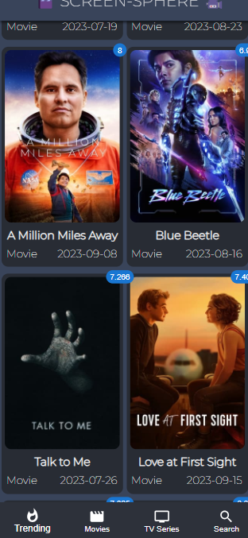
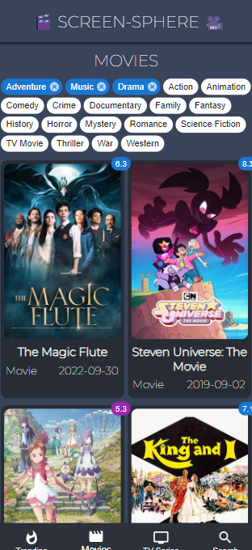
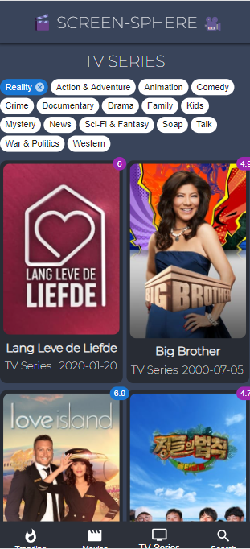
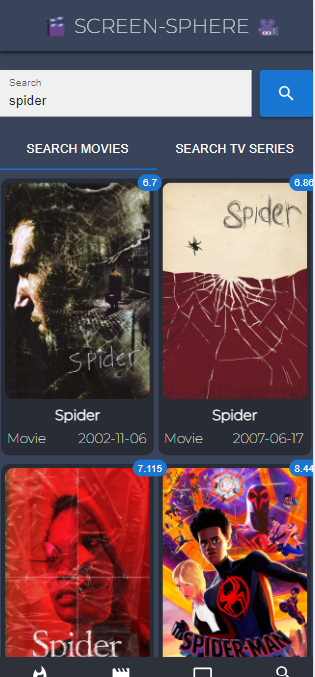

  <a href="https://github.com/carmelBar24/screen-sphere">
     

 
<i>A Search Engine-Web App using <a href="https://react.dev">React 💕</a></i>

## About the Web App 🎥

- Live in: https://screen-sphere.vercel.app/

- Screen Sphere is a series and movies search engine!😍

- You can see the trending movies and series today

- Movies/series can be classified according to genres😎.

- You can search movies/series by characters 🔥

## Pages 😍

  
  

  
  

  
  

  

## In Action 👀

  

